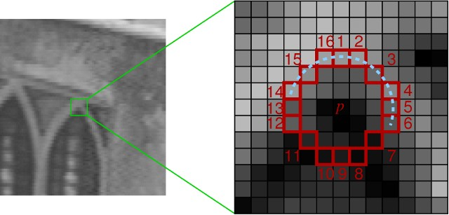

# ORB Keypoint Detector

This project is a custom implementation of the ORB (Oriented FAST and Rotated BRIEF) keypoint detection algorithm. It focuses on constructing the entire keypoint detection pipeline from scratch using NumPy and OpenCV. The detector identifies points of interest in an image — such as corners — and filters them using both geometric rules and intensity-based scoring, making it a crucial tool in tasks like image matching, object tracking, and visual SLAM.

 

                                                                                           

## Features

- ✅ Custom FAST keypoint detection using pixel intensity tests on a Bresenham circle
- ✅ Keypoint scoring using minimum abs-differences over pixel groups
- ✅ Harris corner response calculation for refining keypoint quality
- ✅ Multi-scale keypoint detection using an image pyramid
- ✅ Clean modular Python code with testable components
- ✅ Pytest-based unit testing support
---

## How It Works

### 1. FAST Corner Detection
The detector compares each pixel against a circle of 16 surrounding pixels. A pixel is considered a keypoint if:
- It is significantly brighter or darker than a certain number of neighbors on the circle
- First, a quick 4-point test filters candidates
- Then, a full 16-point check is performed for validation

 
<i><b>Left</b>: rotated FAST keypoints detector. <b>Right</b>: oriented BRIEF keypoints descriptor.</i>

 
<i>In the first step, test the center pixel only against pixels 1, 5, 9, and 13, marked in yellow. Then, if the first test passes, test the center pixel against all 16 pixels on the circle.</i>

### 2. Keypoint Scoring
Each accepted keypoint is scored based on:
- Sliding groups of 9 pixels around the circle
- For each group, compute the absolute intensity difference from the center
- Final score = maximum of all minimum differences (max-min)

 
<i><b>Left</b>: example image. <b>Right</b>: taking 9 consecutive pixels on a circle for the min abs-difference computation.</i>

 
<i>Example of three groups of 9 consecutive pixels. You have to take all 16 such groups and, for each group, calculate the minimum of the absolute differences. The final score is the maximum of those minimums.</i>

### 3. Harris Corner Filtering
To reduce noise and remove uninformative edge responses:
- Sobel derivatives are used to compute gradients
- A 2×2 structure tensor is computed per pixel
- Harris corner score = `det(A) - k * trace(A)^2`

### 4. Multi-Scale Pyramid
- The input image is progressively resized and blurred
- Keypoints are detected on each scale
- Top-N strongest keypoints (by Harris score) are selected per level

